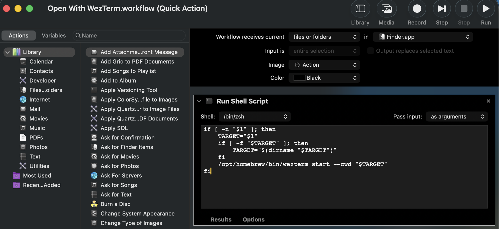
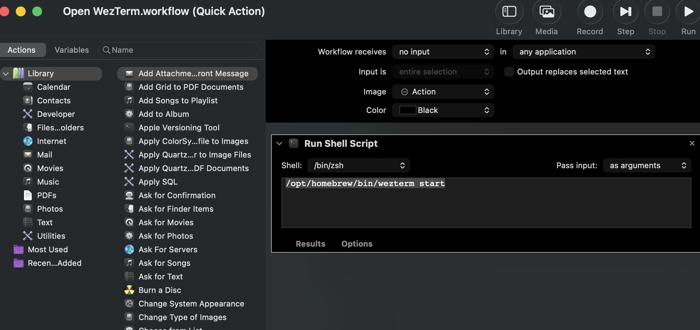

# wezterm-config
## My config: WezTerm + starship + ext
##  1. “Ensure Homebrew is Installed” ✅
##  2. “Install WezTerm via Homebrew” ✅
`brew install --cask wezterm`
##  3. “Install zsh-autosuggestions and zsh-syntax-highlighting via Homebrew ⚡”
`brew install zsh-autosuggestions zsh-syntax-highlighting`

After installation, make sure to add the following lines to your .zshrc to enable them:
Enable zsh-autosuggestions

`source /usr/local/share/zsh-autosuggestions/zsh-autosuggestions.zsh`

Enable zsh-syntax-highlighting

`source /usr/local/share/zsh-syntax-highlighting/zsh-syntax-highlighting.zsh`

##  4. “Install JetBrainsMono Nerd Font Mono (or another Nerd Font) 🔤”
`brew install --cask font-jetbrains-mono-nerd-font`

## 5. "Copy `/config/wezterm/wezterm.lua` to your `~/.config/wezterm/wezterm.lua` 📂"
## 6. “Install Starship Prompt via Homebrew 🚀”
After installation, add the following line to your .zshrc to enable Starship:

`eval "$(starship init zsh)"`

## 7. "Copy `/config/starship.toml` to your `~/.config/starship.toml` 📂"

## 8. “Add Scripts to Open Folders in WezTerm via Automator 📂✨”

Open file/folder with WezTerm:




```bash
if [ -n "$1" ]; then
    TARGET="$1"
    if [ -f "$TARGET" ]; then
        TARGET="$(dirname "$TARGET")"
    fi
    /opt/homebrew/bin/wezterm start --cwd "$TARGET"
fi
```

Open WezTerm:



```bash
/opt/homebrew/bin/wezterm start
```
Or copy scripts from repo to Automator Services folder:

`cp ./scripts/* ~/Library/Services/`
